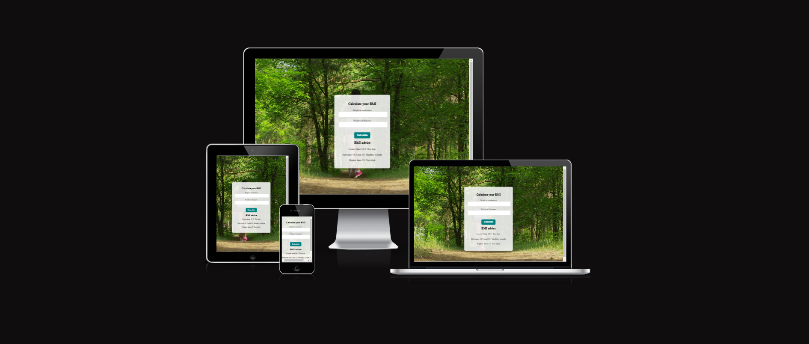

# 🏋️ BMI Calculator

🌐 Website Link: [BMI Calculator](https://purohit1999.github.io/BMI_calculator/)

Welcome to the BMI Calculator project! This repository contains the source code and documentation for an interactive BMI calculator. This README provides an overview of the project, including its features, technologies used, testing, deployment, and more.

## 📋 Table of Contents
1. [🔍 Project Overview](#-project-overview)
2. [🎨 UX/UI Design](#-uxui-design)
3. [🌈 Colour Scheme](#-colour-scheme)
4. [🖋️ Typography](#-typography)
5. [👤 User Stories](#-user-stories)
6. [🖼️ Imagery & Media](#-imagery--media)
7. [📐 Wireframes](#-wireframes)
8. [🎭 Design Choices](#-design-choices)
9. [✨ Features](#-features)
10. [🛠️ Technologies Used](#-technologies-used)
11. [🧪 Testing](#-testing)
12. [📁 File Overview](#-file-overview)
13. [🚀 Deployment](#-deployment)
14. [🙏 Credit](#-credit)
15. [📝 Content](#-content)
16. [👏 Acknowledgements](#-acknowledgements)

## 🔍 Project Overview
The BMI Calculator is an interactive web app designed to calculate users' Body Mass Index (BMI) based on their height (in centimeters) and weight (in kilograms). It includes a draggable form interface with immersive video and audio backgrounds to enhance user engagement. Users receive instant feedback on their BMI category (underweight, healthy weight, overweight) based on the calculated result.

### Key Functionalities
- Calculate BMI with height in centimeters and weight in kilograms.
- Draggable form for flexibility on the page.
- Interactive background with video, image transitions, and audio.
- Display BMI categories with corresponding health advice.

## 🎨 UX/UI Design

### 🎯 Project Goals
The BMI Calculator aims to provide users with an engaging experience while calculating their BMI. The form and background video are designed to create an immersive, user-friendly interface.

- **Interactivity**: Real-time updates and animations enhance engagement.
- **Clarity**: Minimalist design keeps the focus on functionality.
- **Accessibility**: Transparent, movable form for better visibility and access.
- **Responsiveness**: Adapts to various device screen sizes for ease of use.

### 👥 User Goals
- Quickly and accurately calculate BMI.
- Receive visual and numerical feedback on BMI results.
- Enjoy a visually appealing, interactive experience.

## 🌈 Colour Scheme

The color scheme is chosen to reflect a professional yet energetic tone:
- **Primary**: Teal for button elements.
- **Secondary**: White with opacity for the form background.
- **Accent**: Blue for highlighted BMI results.

## 🖋️ Typography

- **Font Family**: `Poppins`, sans-serif for modern and clean readability.
- **Font Sizes**: Slightly larger font for headings and BMI results to maintain visibility across screen sizes.

## 👤 User Stories

### 🧑‍💻 As a User, I want to:
1. **Easily input my height and weight** and see my BMI calculated instantly.
2. **Understand my BMI category** based on the result (underweight, healthy weight, overweight).
3. **Interact with the page** while enjoying a smooth, visually immersive background.

## 🖼️ Imagery & Media
The project includes:
- **Background Video**: A slow-motion gym video for dynamic ambiance.
- **Zoom and Pan Image Effect**: Transition to an image with subtle zoom/pan after the video.
- **Audio**: Background gym sounds to add atmosphere.

## 📐 Wireframes

The wireframes illustrate the responsive design for mobile, tablet, and desktop views. This project layout includes a centrally placed form with a responsive, interactive background.

- [Mobile Wireframe](assets/wireframes/mobile.png)
- [Tablet Wireframe](assets/wireframes/tablet.png)
- [Desktop Wireframe](assets/wireframes/desktop.png)

## 🎭 Design Choices

The design is focused on clarity and interactivity, allowing users to move the form freely on the screen. The transparent form overlays a background video, creating an immersive experience without obstructing the BMI functionality.

## ✨ Features

- **Responsive Design**: The form and background adapt seamlessly to different screen sizes.
- **Draggable Form**: Users can reposition the form for optimal viewing.
- **BMI Calculation**: Calculates BMI based on metric units (height in cm and weight in kg).
- **Background Animation**: Video with zoom/pan image transitions, adding visual appeal.
- **Audio Playback**: Background sounds for an immersive experience.

## 🛠️ Technologies Used

### 🌐 Frontend Technologies
- **HTML5**: Structure of the webpage, including the form elements.
- **CSS3**: Styling for responsive design, animations, and transparency effects.
- **JavaScript (ES6+)**: Handles BMI calculation, form interaction, and background effects.

### 🎨 Design Tools
- **Google Fonts**: `Poppins` font for consistent and modern typography.
- **Font Awesome**: Icons used for visual indicators in the form.

## 🧪 Testing

### Testing Overview
The project was tested across devices and browsers to ensure functionality, responsiveness, and visual integrity. Key tests included:

- **BMI Calculation Accuracy**: Verified formula accuracy.
- **Form Dragging**: Ensured smooth dragging across devices.
- **Video and Audio Sync**: Confirmed smooth playback and transitions between video and image backgrounds.

### Validation
- **HTML Validation**: Passed with no errors using W3C Validator.
- **CSS Validation**: Passed with no errors using W3C CSS Validator.
- **JavaScript Console**: No errors in console log.

## 📁 File Overview

- **index.html**: Contains the HTML structure for the BMI Calculator.
- **style.css**: CSS for styling, transparency, and animations.
- **script.js**: JavaScript for BMI calculation, form dragging, and background interactions.
- **assets/**: Folder containing images, video, and audio files.

## 🚀 Deployment

The project was deployed using GitHub Pages:
1. Go to the repository's Settings.
2. Enable GitHub Pages under the "Pages" section.
3. Choose the branch (usually `main`) and save.
4. The page is live at: [BMI Calculator](https://purohit1999.github.io/BMI_calculator/)

## 🙏 Credit

- **Video and Images**: Stock footage and images from [Pexels](https://pexels.com).
- **Audio**: Background sounds from [FreeSound](https://freesound.org).
- **Inspiration**: Code Institute's project resources.

## 📝 Content

All content for the BMI categories and health advice was written by the developer.

## 👏 Acknowledgements

- **Mentor Support**: Thanks to my mentor for guidance on interactivity and UI design.
- **Code Institute**: For providing the project brief and structure.
- **Open Source Libraries**: Font Awesome for icons and Google Fonts for typography.

